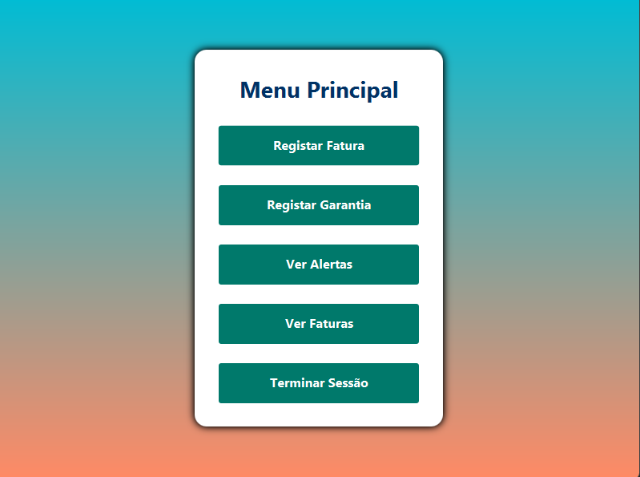
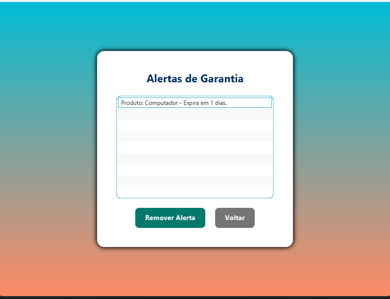
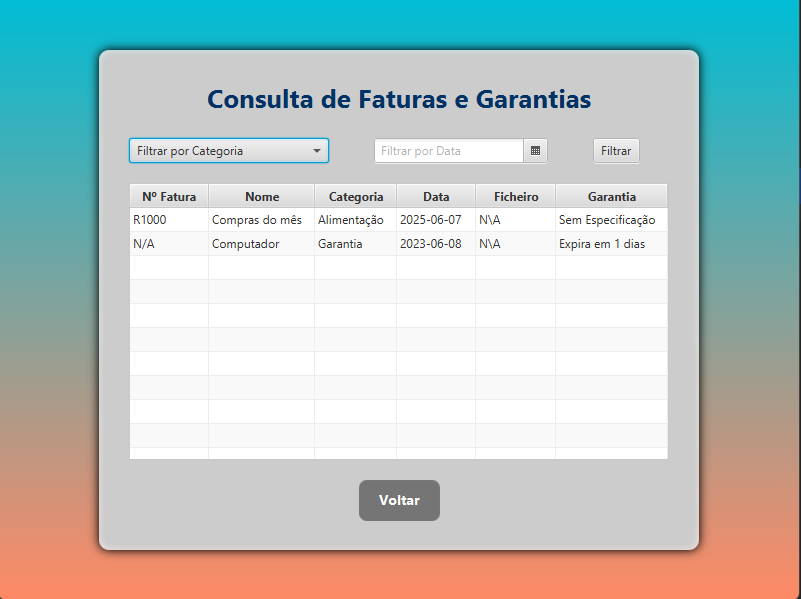

# 💻 Projeto JavaFX – Gestão de Garantias e Faturas

Este é um sistema de gestão desenvolvido com **Java** e **JavaFX**, utilizando o padrão **MVC**. A aplicação permite aos usuários registrarem-se, efetuarem login, cadastrarem garantias e faturas, e consultarem informações com uma interface moderna e intuitiva.

---

## 🚀 Funcionalidades

- 🔐 Login e registro de usuários
- 🧾 Registo e consulta de faturas
- 📦 Registo e acompanhamento de garantias
- 📅 Alertas de vencimento de garantias
- 📁 Upload de documentos (fatura/garantia)
- 🎨 Interface gráfica em FXML com estilo moderno

---

## 🛠️ Tecnologias Utilizadas

- Java 17+
- JavaFX
- Scene Builder
- MVC (Model-View-Controller)

---

## 📷 Capturas de Tela

### 🔐 Ecra de Login


### 📝 Ecra de Registo


### 🧭 Menu Principal


### 📑 Registo de Fatura


### 📄 Registo de Garantia


### 🚨 Alertas de Garantia


### 📊 Consulta de Registos


> **Nota**: todas as telas possuem responsividade mínima e seguem um padrão visual coeso com gradiente e cantos arredondados.

---

## 📁 Estrutura do Projeto

```

## ▶️ Como Executar

1. Clone o repositório:
   ```bash
   git clone https://github.com/NomeGit/nome-do-repo.git
   cd nome-do-repo
   ```

2. Realizado no NetBeans e SceneBuilder.

3. Certifique-se de que o JavaFX está corretamente configurado no SDK.

4. Execute a aplicação pela classe `Trabalho_Final.java`.

---

## 🧪 Requisitos

- JDK 17 ou superior
- JavaFX SDK configurado
- IDE com suporte a JavaFX

---

## 👤 Autores

**Fábio Horta**  

[GitHub](https://github.com/FabioHorta) | [LinkedIn](https://www.linkedin.com/in/fábio-horta-096aa717b/)

**Daniel Almeida**  

[GitHub](https://github.com/dannylalmeida)

---

